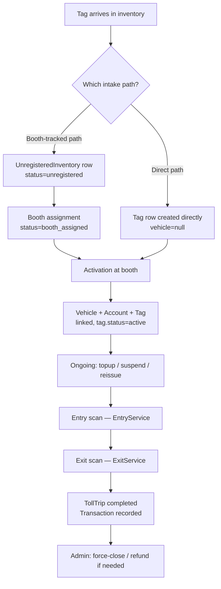

# Tag Lifecycle — Inventory to Trips

**Status:** Draft for review
**Scope:** Traces a single RFID tag from arriving in inventory through to being
used for toll entry/exit, based on the code as it currently exists in
`mtag_backend/apps/vehicles`, `apps/accounts`, and `apps/tolls`.

---

## 1. Overview

There are **two intake paths** in the codebase and they converge at
activation. Which one a given deployment uses depends on whether inventory
is tracked per-booth before activation, or tags are just made available and
activated on first use.

---

## 2. Stage 1 — Tag enters inventory

### Path A: Booth-tracked inventory (`UnregisteredInventory`)

Used when tags are pre-assigned to a specific booth before they're ever
scanned. CSV upload → `POST /vehicles/inventory/upload/`
(`InventoryUploadView`, [views.py:409](../mtag_backend/apps/vehicles/views.py#L409)):

- Each row (`tag_serial`, `tid`, `epc`, optional `vehicle_plate`/`vehicle_type`/`vehicle_color`) becomes an `UnregisteredInventory` row, `status = unregistered`.
- Duplicates (by `tag_serial` or `tid`) are skipped, not errored.
- **No `Tag` row is created at this point** — `UnregisteredInventory` is a separate tracking table, not the `Tag` model the gate uses.

List/search: `GET /vehicles/inventory/` (`InventoryListView`) — filter by status, booth, vehicle type, search.

### Path B: Direct tag inventory (`Tag` model directly)

Used when tags don't need per-booth pre-assignment. Three entry points, all
creating `Tag` rows with `vehicle = null`:

- `POST /vehicles/tags/` (`TagCreateView`) — single tag, `status = active`.
- `POST /vehicles/tags/bulk/` (`TagBulkCreateView`) — bulk insert from a handheld scanner session, auto-generates `tag_serial` (format `DDMMYYHHMM` + sequence), `status = deactivated` until activated.
- `POST /vehicles/tags/upload/` (`TagInventoryUploadView`) — CSV upload, `status = active`.

These tags are immediately visible to `AvailableTagsView` (`GET /vehicles/tags/available/`) for manual assignment during vehicle registration.

---

## 3. Stage 2 — Booth assignment *(Path A only)*

`POST /vehicles/inventory/assign-booth/` (`BoothAssignmentView`):

- Takes a list of `UnregisteredInventory` IDs + a `booth_id` (plaza 1–7).
- Sets `status = booth_assigned`, stamps `booth_assigned_at`.
- Creates a `BoothInventoryAssignment` audit row per tag (who assigned it, when).
- A tag can only later be activated at the booth it was assigned to (enforced at activation — see below).

Check status any time: `GET /vehicles/inventory/check/<tag_serial>/` (`InventoryCheckView`) — returns `can_activate` (true once booth-assigned) and `activation_required`.

---

## 4. Stage 3 — Activation

This is where a tag becomes usable at the toll gate: a `Tag` row gets created
(or linked) with `vehicle` set, plus a `Vehicle` and `Account`.

### The path actually wired to the frontend: cash topup

The **operational** activation flow is the cash-topup app
(`InventoryActivationModal.tsx` → `accountsApi.topupLookup` /
`accountsApi.cashTopup`), not the `/vehicles/inventory/activate*` endpoints
(see note below).

1. **Lookup** — `POST /accounts/topup/lookup/` (`TopupLookupView`,
   [views.py:26](../mtag_backend/apps/accounts/views.py#L26)): given a scanned
   `tid`, returns the consumer's details if the tag is already registered, or
   `found: false` (+ `UnregisteredInventory` status if it exists) so the
   operator knows to register it.

2. **Cash topup / register** — `POST /accounts/topup/cash/` (`CashTopupView`,
   [views.py:63](../mtag_backend/apps/accounts/views.py#L63)), one atomic
   transaction:
   - **Tag already registered** (has a `Vehicle` + `Account`) → simple topup:
     lock the account, add `amount`, record a `TOPUP_CASH` transaction, print
     a receipt.
   - **Tag not registered** → full activation:
     - Validates `consumer_name` + `phone` + `vehicle_reg` are present, plate isn't already taken.
     - Finds or creates the `User` (by phone).
     - Creates the `Vehicle`.
     - Creates the `Tag` row:
       - if a `Tag` row already existed for this `tid` (from Path B) → assign `vehicle`, set `status = active`.
       - else if this `tid` matches a booth-assigned `UnregisteredInventory` row → create `Tag` using its **printed `tag_serial`**, enforcing the booth-assignment check (`inv.booth_assigned_id` must match `activation_booth_id`, and it must not already be `activated`).
       - else (brand-new `tid`, no inventory record at all) → create `Tag` with an auto-generated serial.
     - Creates the `Account` with `balance = amount` (the topup amount becomes the opening balance).
     - If this came from a booth-assigned inventory row: marks it `status = activated`, stamps `activated_for_account`/`first_activated_booth_id`/`first_activated_at`, and writes a `TagActivation` audit row.
     - Prints an activation/topup receipt.

### An older, currently-unused activation path

`apps/vehicles/views.py` also defines `TagActivationQuickCreateView`
(`POST /vehicles/inventory/activate/`) and `TagActivationLinkExistingView`
(`POST /vehicles/inventory/activate-existing/`). They predate the cash-topup
flow and nothing in the frontend calls them; the cash-topup path above is the
one wired to the UI.

They used to create a `Vehicle` + `Account` and mark `UnregisteredInventory`
activated **without creating a `Tag` row**, so a tag activated through them was
not scannable at the gate (`EntryService` looks up `Tag.objects.get(tid=...)`,
not `UnregisteredInventory`) — the endpoint answered `201 Tag activated` while
the barrier answered `Tag not found`. They also 500'd for any customer not
already in the database (`create_user` was called without its required
`password` argument), and capped `activation_booth_id` at 7, which rejected
plazas 101-107.

All three are fixed and covered by regression tests in
`apps/vehicles/tests_inventory.py`, so the endpoints are now correct rather
than silently wrong. They remain candidates for removal — the decision in
`docs/superpowers/specs/2026-07-11-booth-inventory-consistency-design.md` was
to supersede them with `activation_booth_id` on the topup endpoints rather
than build on them — but they are no longer a trap if something does call
them.

---

## 5. Stage 4 — Ongoing account operations

Once a tag is activated (`Tag.vehicle` set, `Account` exists), it can be:

- **Topped up again** — `CashTopupView` (existing-tag branch), or
  `POST /accounts/operator/topup/` (`OperatorTopupView`, by `tag_serial`), or
  `POST /accounts/topup/plate/` (`PlateTopupView`, by plate number). All three
  lock the account, add the amount, write a `TOPUP` transaction.
- **Suspended / reactivated** — `POST /vehicles/<pk>/suspend/`
  (`VehicleSuspendView`): flips `Vehicle.status` and, if a tag exists, the
  matching `Tag.status` between `active` and `suspended`. A suspended vehicle
  fails `EntryService`'s `vehicle.status != 'active'` check.
- **Tag reissued** — `POST /vehicles/tags/<vehicle_id>/reissue/`
  (`TagReissueView`): deactivates the vehicle's current tag
  (`status = deactivated`, `vehicle = null`) and assigns a different
  *unassigned* tag from inventory (`vehicle__isnull=True`) to the same
  vehicle. Used when a physical tag is lost/damaged and swapped.
- **Balance transferred between vehicles** — `POST /accounts/transfer/`
  (`TransferView` → `TransferService`).

---

## 6. Stage 5 — Entry (trip starts)

`POST /tolls/entry/` (`VehicleEntryView`) → `EntryService.process_entry()`
([services.py](../mtag_backend/apps/tolls/services.py)). As of the
online-only change (see
[ONLINE-ONLY-ROLLOUT-PLAN.md](ONLINE-ONLY-ROLLOUT-PLAN.md)):

1. Reject outright if master DB is unreachable (`ONLINE_ONLY_MODE`).
2. Look up `Tag` by `tid` (the physical chip ID scanned at the gate — **not**
   the same as `tag_serial`, the printed/label ID). Reject if not found, not
   assigned to a vehicle, not `active`, or expired.
3. Reject if `Vehicle.status != active` (suspended vehicles can't enter).
4. Lock the `Account`, reject if balance is below `MINIMUM_BALANCE` (Rs. 50).
5. Reject if the vehicle already has an active `TollTrip` (double-entry guard).
6. Create the `TollTrip` (`status = active`, `entry_plaza`, `entry_lane`, `entry_time`).
7. Dual-write the trip to master synchronously; roll back locally if that fails.

---

## 7. Stage 6 — Exit (trip completes, fare charged)

`POST /tolls/exit/` (`VehicleExitView`) → `ExitService.process_exit()`:

1. Same online-only gate as entry.
2. Look up `Tag` by `tid`.
3. Find the vehicle's active `TollTrip` — local DB first, then an
   authoritative fallback query straight to master if it's not there yet
   (covers the case where the entry hasn't propagated from another plaza).
4. Look up the fare from `TollRate` by `(entry_plaza, exit_plaza, vehicle_type)` — this is the "fare matrix" lookup, served from an in-memory cache.
5. Lock the `Account`, reject if balance < fare.
6. Deduct the fare, close the `TollTrip` (`status = completed`, `exit_plaza`, `exit_time`, `charge_amount`, `balance_before`/`after`).
7. Record a `Transaction` (`type = toll_deduction`).
8. Dual-write trip + account balance + transaction to master in one shot; roll back all three locally if that fails.

---

## 8. Stage 7 — Admin trip management (exception handling)

- **Force-close a stuck trip** — `POST /tolls/admin/trips/<id>/close/`
  (`AdminTripCloseView`): marks an active trip `status = failed` with no
  charge. Used when a vehicle never exits (e.g., tag failure) and the trip
  needs clearing manually.
- **Refund a completed trip** — `POST /tolls/admin/trips/<id>/refund/`
  (`AdminTripRefundView`): re-credits `charge_amount` back to the account,
  writes a `REFUND` transaction. Guarded against double-refunding the same trip.

---

## 9. Data model summary

| Model | Purpose | Created at | Key relations |
|---|---|---|---|
| `UnregisteredInventory` | Tracks a tag through booth assignment before activation (Path A only) | Inventory CSV upload | → `Account` (once activated) |
| `BoothInventoryAssignment` | Audit trail of which booth a tag was assigned to, by whom | Booth assignment | → `UnregisteredInventory` |
| `TagActivation` | Audit record of first activation (auto-created vs linked to existing account) | Activation | → `Account` |
| `Tag` | The physical RFID chip — what the gate actually scans (`tid`) and looks up | Direct upload (Path B), or activation (Path A) | → `Vehicle` (nullable until assigned) |
| `Vehicle` | The registered vehicle | Vehicle registration or activation | → `User` (owner), → `Tag` (reverse), → `Account` |
| `Account` | Prepaid balance for a vehicle | Activation, or direct vehicle registration | → `Vehicle` (1:1), → `Transaction` |
| `Transaction` | Immutable audit log of every balance change (topup, toll deduction, refund, transfer) | Any balance-changing action | → `Account`, → `TollTrip` (nullable) |
| `TollTrip` | One entry→exit journey | Entry scan | → `Vehicle`, `Tag`, `Account`, `Plaza` ×2 |

---

## 10. Things worth deciding / cleaning up

- **Two parallel intake paths** (`UnregisteredInventory` booth-tracked vs.
  direct `Tag` creation) converge only at `CashTopupView`, and that view's
  branching logic (existing `Tag` row vs. booth-assigned inventory vs.
  brand-new) is the only place that reconciles them. Worth confirming this
  is the intended long-term design rather than incidental — if booth
  pre-assignment is meant to be mandatory, the "brand-new tag, no inventory
  record" branch in `CashTopupView` bypasses that requirement entirely.
- **`TagActivationQuickCreateView` / `TagActivationLinkExistingView`** appear
  unused by the frontend and don't create a `Tag` row, so activating through
  them would leave a tag unscannable at the gate. Confirm whether anything
  else calls them before removing.
- **`tag_serial` vs `tid`** — worth double-checking every intake path agrees
  on which is the printed label vs. the chip ID scanned at the gate, since
  `EntryService`/`ExitService` match strictly on `tid`, not `tag_serial`.
